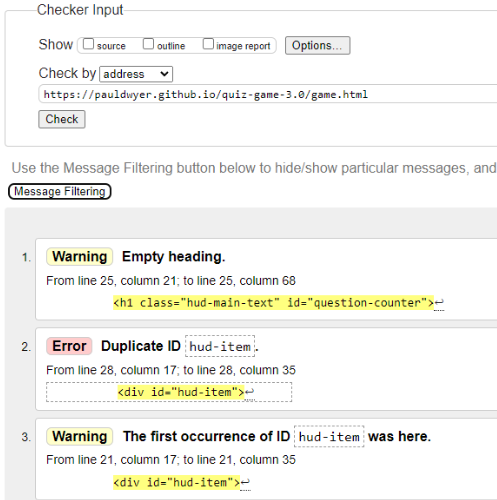

# Pauls Quiz Game

## UX 

### Project Goals

### User Stories

## Features 

### Existing Features

### Future Features

## Technology Used

  - [HTML5](https://www.w3schools.com/html/)

  - [CSS](https://www.w3schools.com/css/css_intro.asp)

  - [GitPod](https://gitpod.io/)

  - [GitHub](https://github.com/)

  - [Chrome Developer Tools](https://developer.chrome.com/docs/devtools/)

## Testing 

### Manual Testing

### Validator Testing 
- HTML
  - Index.html no errors were returned when passing through the official [W3C validator](https://validator.w3.org/nu/?doc=https%3A%2F%2Fpauldwyer.github.io%2Fquiz-game-3.0%2Findex.html)
  - Game.html showed 2 warnings and 1 error.
  
  - Willing to accept the empty heading warning as this heading will be populated as part of the getNewQuestion() Function.
  - Game.html showing 1 error. As pointed out above, willing to accept this error. [W3C validator](https://validator.w3.org/nu/?doc=https%3A%2F%2Fpauldwyer.github.io%2Fquiz-game-3.0%2Fgame.html)
  - End.html showing 1 error. Willing to accept this error as the blank space is populated by the end.js file. [W3C validator](https://validator.w3.org/nu/?doc=https%3A%2F%2Fpauldwyer.github.io%2Fquiz-game-3.0%2Fend.html)
  - highscores.html no errors were returned when passing through the official [W3C validator](https://validator.w3.org/nu/?doc=https%3A%2F%2Fpauldwyer.github.io%2Fquiz-game-3.0%2Fhighscores.html)

### Unfixed Bugs

## Deployment

## Credits 

[w3schools](https://www.w3schools.com/html/default.asp) code for the tutorials page and timetable was taken from w3schools.

[Flexbox Frogy](https://flexboxfroggy.com/) this game thought me how to use flex box.

### Content 

### Media

