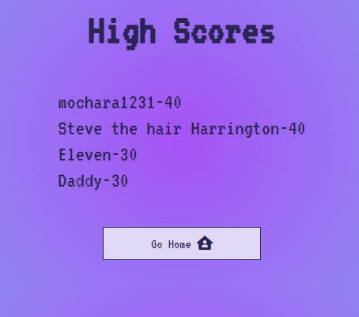
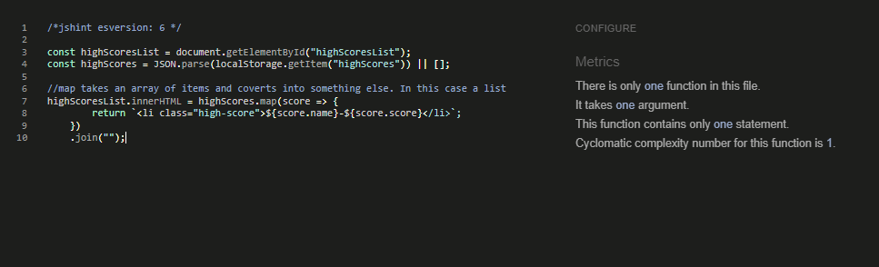
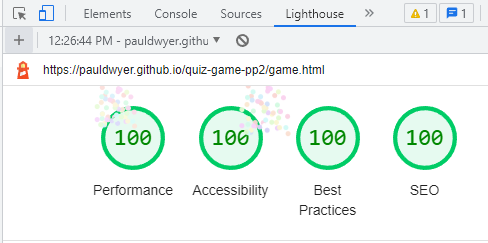

# Quiz Game / Stranger Things Quiz

Quiz Game is a Stranger Things Quiz that is aimed at viewers of the hit tv series "Stranger Things". 

It is meant as a bit of light-hearted fun and to test people on their Stranger Things knowledge.

There is a high scores leaderboard so users can compare their high scores.

The live link can be found here - https://pauldwyer.github.io/quiz-game-pp2/

## UX 

### Project Goals

The scope of this project was to build an interactive front-end site. The site should respond to the users' actions, allowing users to actively engage with data, and alter the way the site displays the information to achieve their preferred goals.
Required technologies: HTML, CSS, JavaScript.

### User Stories

1. As an external user I want to test my knowledge.
2. As an external user I want to have some fun.
3. As the site owner I want to provide a quiz to challenge visitors.
4. As the site owner I want to have vibrant colour schemes to match the aesthetic of the quiz.
5. As the site owner I want to have site visitors return and re-do the quiz to achieve high scores.

### Design

- Colours
  - For the colours for this site I took inspiration from Cyberpunk themes and Synthwave themes. I like that aesthetic and since Stranger Things is set in the 80s I feel like these were a perfect match.
  I used the following 2 palettes for most of the colours on the site.
  
  

  - For the background colour a gradient was made from the following 3 colours. Gradient generated with [CSS Gradient.io](https://cssgradient.io/)
  

- Font
  - For the font I used VT323, I was searching google looking for 80s-style fonts and I found this GitHub page [Fonts Inspiration](https://github.com/torch2424/aesthetic-css). This page had a list of google fonts that work well with the theme and aesthetic I was going for.

- Wireframes
  - Wire frames were used to do a rough draft of what the home page, game page and end game page would look like. the site was designed mobile first from the beginning.

  

## Features 

In this section, I will show and discuss all the features of the site.

### Existing Features

- Home is the first page you see when you open the site. It clearly states the name of the quiz and has one button for Play and one button for Highscores.
    - The play button initiates the start of the quiz.
    - The high scores button brings you to a different page that has the list of high scores.
    - The footer clearly states the site is built for academic purposes and has a link to the developers' GitHub.

- Game page. The game starts when you click the play button. You are brought to a different page that has multiple choice questions.
  - There is a question counter in the top left corner to show which question the user is on.
  - There is a score counter in the top right corner that increments by 10 points every time the user gets a question correct.
  - The question is displayed.
  - Four multiple choice answers are provided.
  - When you hover over an answer there is a hover effect on mouseover.
  - If you select correct or incorrect answers the buttons will highlight with a different colour respectively.

- End page is displayed when all four questions have been answered. This page has a total score at the top, four buttons and a footer.
  - Total score at the top of the screen shows what score the user received.
  - The username button allows the user to input a username to show on the high scores list
  - Save button is only available when the user has inputted a username. This allows the user the save their username on the high score list. Once save is clicked the user is brought to the High-Scores page.
  - Play Again button allows the user to play the game again.
  - Go Home button allows the user to return to the home page.

- High Scores page shows a list of the top 5 scores that have been recorded.

### Future Features

- Add more questions / have the quiz take questions from an API.

- Play some synth wave music in the background when the quiz starts.

- Add supporting images.

- Possibly change the way the answers are submitted and add a submit button.

- Add a countdown timer for each question.

## Technology Used

  - [HTML5](https://www.w3schools.com/html/) - Website was built wasing HTML5.

  - [CSS](https://www.w3schools.com/css/css_intro.asp) - Website was styled using CSS.

  
  - [JavaScript](https://www.w3schools.com/js/) - Interactivity was added with JavaScript

  - [GitPod](https://gitpod.io/) - Site was developed using GitPod in broswer IDE.

  - [GitHub](https://github.com/) - Repository and version control was hosted with GitHub

  - [Chrome Developer Tools](https://developer.chrome.com/docs/devtools/) - Was used for testing and debugging.

# Testing 

Throughout the development of the project, code was regularly tested using Chrome developer tools, manual testing was performed and code was passed through validators like W3C for HTML, Jigsaw for CSS and Jshint for JS.

List of devices that the website was tested on for responsiveness through chrome developer tools:

- iPhone SE
- iPhone XR
- iPhone 12 Pro
- Pixel 5
- Samsung Galaxy S8
- Samsung Galaxy S20 Ultra
- Samsung Galaxy A51/71
- Samsung Galaxy A52/A53 5g

## Manual Testing

- The site was tested manually on google chrome desktop.
- Goal of the testing was to check the functionality of each button across all pages. If they were working as intended and eliciting the correct response ie. increment the score for each correct answer, and change the colour for correct and incorrect answers.
- See below for steps, expected results and results.

- Manual testing was also performed on google chrome for android mobile.
- See below for steps, expected results and results.

## Validator Testing 

- HTML

  - Index.html no errors were returned when passing through the official [W3C validator](https://validator.w3.org/nu/?doc=https%3A%2F%2Fpauldwyer.github.io%2Fquiz-game-pp2%2F)

  - Game.html showed 2 warnings and 1 error.
  
  
   
   Willing to accept the empty heading warning as this heading will be populated as part of the getNewQuestion() Function. I could have put a placeholder in the heading but choose not to.
   I fixed the error by removing obsolete IDs.
   Game.html now showing 1 warning. As pointed out above, willing to accept this warning. [W3C validator](https://validator.w3.org/nu/?doc=https%3A%2F%2Fpauldwyer.github.io%2Fquiz-game-pp2%2Fgame.html)

  - End.html showing 1 warning. Willing to accept this warning as the blank space is populated by the end.js file. [W3C validator](https://validator.w3.org/nu/?doc=https%3A%2F%2Fpauldwyer.github.io%2Fquiz-game-pp2%2Fend.html)

  - Highscores.html no errors were returned when passing through the official [W3C validator](https://validator.w3.org/nu/?doc=https%3A%2F%2Fpauldwyer.github.io%2Fquiz-game-pp2%2Fhighscores.html)

- CSS

  - Style.css no errors were found when passing through the official [(Jigsaw) validator](https://jigsaw.w3.org/css-validator/validator?uri=https%3A%2F%2Fpauldwyer.github.io%2Fquiz-game-3.0%2Findex.html&profile=css3svg&usermedium=all&warning=1&vextwarning=&lang=en)
  - Highscores.css no errors were found when passing through the official [(Jigsaw) validator](https://jigsaw.w3.org/css-validator/validator?uri=https%3A%2F%2Fpauldwyer.github.io%2Fquiz-game-3.0%2Fhighscores.html&profile=css3svg&usermedium=all&warning=1&vextwarning=&lang=en)
  - 1 Error found in game.css
  
  - Game.css error has been fixed and no errors were found when passing through the official [(Jigsaw) validator]() --- Add

- JavaScript

  - Script.js accepting these warnings. No errors were shown.

    

  - High-scores.js No errors or warnings were shown.

    

  - Accepting these warnings. One unused variable sets the max number of high scores to five. One undefined variable adds the score to an array, sorts the array and splices out the lowest and keeps the array at a length of five. No errors were shown.

    

## Lighthouse Testing

- Home page mobile

- Game page mobile

- End page mobile

- Highscore page mobile

- Home page desktop

- Game page desktop

- End page desktop

- Highscores page desktop

## Bugs

- The first bug I encountered during development was incorrect file paths when the site was deployed to GitHub Pages.
  I was using the incorrect file paths, which worked correctly when using a live 8000 server from GitPod but once the site was deployed all links were broken. The play button on the home page and the buttons to answer questions were the only buttons that worked correctly.
  To fix this issue I used the relative file path for all page links.

- The second bug I encountered was when the site was live when using chrome developer tools there were console errors when on the home page, end page and high scores page. See the below screenshot of the error.
To fix this error I removed the script.js from those 3 pages. This fixed the console error.    

# Deployment

## How this Project was Deployed

- The site was deployed to GitHub pages. The steps to deploy are as follows: 
  1. Log into GitHub and navigate to the quiz-game-pp2 repository.
  2. In the GitHub repository, navigate to the Settings tab 
  3. In settings click the Pages link on the left sidebar
  4. From the source section drop-down menu, select the Master Branch
  5. Once the master branch has been selected, the page will be automatically refreshed with a detailed ribbon display to indicate the successful deployment. 
  6. On Page refresh, scroll back down to the GitHub Pages section, and the link to the deployed site will be available.

  The live link can be found here - https://pauldwyer.github.io/quiz-game-pp2/

## Cloning the repository

1. Visit [Quiz-game-pp2 respository](https://github.com/Pauldwyer/quiz-game-pp2).
2. Click the "Code" dropdown box above the repository's file explorer.
3. Under the "Clone" heading, click the "HTTPS" sub-heading.
4. Click the clipboard icon, or manually copy the text presented:https://github.com/Pauldwyer/quiz-game-pp2.git
5. Open your preferred IDE.
6. Ensure your IDE has support for Git or has the relevant Git extension.
7. Open the terminal, and create a directory where you would like the Repository to be stored.
8. Type git clone and paste the previously copied text (https://github.com/Pauldwyer/quiz-game-pp2.git) and press enter.
9. The repository will then be cloned into your selected directory.

## Manually Downloading the Repository

1. Visit [Quiz-game-pp2 respository](https://github.com/Pauldwyer/quiz-game-pp2). 
2. Click the "Code" dropdown box above the repository's file explorer.
3. Click the "Download Zip" option; this will download a copy of the selected branch's repository as a zip file.
4. Locate the ZIP file downloaded to your computer, and extract the ZIP to a designated folder in which you would like the repository to be stored.

## Opening the Repository

1. Open your preferred IDE.
2. Navigate to the chosen directory where the Repository was cloned/extracted.
3. You will now have offline access to the contents of the project.

# Credits 

[w3schools](https://www.w3schools.com/js/default.asp) - Helped me understand JavaScript more.

[Scrimba](https://scrimba.com/allcourses?topic=javascript) - I did the learn JavaScript for free course when I finished the JavaScript essentials module. It helped me understand JS more.

[Fonts Inspiration](https://github.com/torch2424/aesthetic-css) - Found this page when looking for fonts.

[Web Dev Simplified Youtube](https://www.youtube.com/watch?v=riDzcEQbX6k&t=458s) - This tutorial helped me a lot with understanding how to write a quiz, what's required, having colours change for correct or incorrect answers.

[Brian Design Youtube](https://www.youtube.com/watch?v=f4fB9Xg2JEY&t=2614s) - A lot of inspiration for code is taken from this tutorial. I learned about CSS Gradient colours from this video.

[James Q Quick](https://www.youtube.com/watch?v=rFWbAj40JrQ&list=PLB6wlEeCDJ5Yyh6P2N6Q_9JijB6v4UejF) - A lot of inspiration for code taken from this tutorial. How to make the main function and how to store the high scores in local storage.

[CodingNepal](https://www.youtube.com/watch?v=WUBhpSRS_fk) - A tutorial that helped me understand making a quiz game.

[Stackoverflow](https://stackoverflow.com/) - Helped a lot when troubleshooting errors.

[Coolors.co](https://coolors.co/) - Used to generate colour palletes.

[CSS Gradient.io](https://cssgradient.io/) - Used to generate gradient for background colour.

[Favicon.io](https://favicon.io/) - Was used to generate a favicon for the site.

[Flexbox Frogy](https://flexboxfroggy.com/) this game thought me how to use flex box.

### Media

No external media was used for this site.

# Closing Thoughts

I came out of the JavaScript Essentials module scratching my head a little bit.
I had a meeting with my mentor before starting work on the project and he reassured me that I generally wasn't the only one feeling like this when finishing the module.
He pointed me towards scrimba and doing that free course really helped me understand JS a lot better. 

I did 4 different quiz tutorials before actually starting the project to see what kind of logic and functions are required. You can see the influences present in the finished project.

As with my first project, I feel I have learned a huge amount about JavaScript and web development from coding this project.

