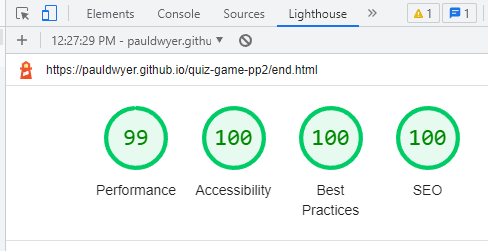
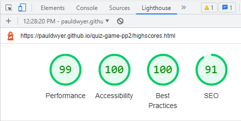

# Quiz Game / Stranger Things Quiz

Quiz Game is a Stranger Things Quiz that is aimed at viewers of the hit tv series "Stranger Things". 

It is meant as a bit of light-hearted fun and to test people on their Stranger Things knowledge.

There is a high scores leader board so users can compare their high scores.

## UX 

### Project Goals

The scope of this project was to build an interactive front-end site. The site should respond to the users' actions, allowing users to actively engage with data, and alter the way the site displays the information to achieve their preferred goals.
Required technologies: HTML, CSS, JavaScript.

### User Stories

### Design

- Colours
  - For the colours for this site I took inspiration from Cyberpunk themes and Synthwave themes. I really like that aestheic and since Stranger Things is set in the 80s i feel like these were a perfect match.
  I used the following 2 palletes for most of the colours on the site.
  
  

  - For the background colour a gradient was made from the following 3 colours. Gradient generated with [CSS Gradient.io](https://cssgradient.io/)
  

- Font
  - For the font I used VT323, I was searching google looking for 80s style fonts and I found this GitHub page [Fonts Inspiration](https://github.com/torch2424/aesthetic-css). This page had a list of google fonts that work well with the theme and aesthic i was going for.

## Features 

In this section, I will show and discuss all the features of the site.

### Existing Features

- Home is the first page you see when you open the site. It clearly states the name of the quiz and has one button for Play and one button for Highscores.
    - The play button initiates the start of the quiz.
    - The high scores button brings you to a different page that has the list of high scores.
    - The footer clearly states the site is built for academic purposes and has a link to the developers' GitHub.

- Game page. The game starts when you click the play button. You are brought to a different page that has multiple choice questions.
  - There is a question counter in the top left corner to show which question the user is on.
  - There is a score counter in the top right corner that increments by 10 points every time the user gets a question correct.
  - The question is displayed.
  - Four multiple choice answers are provided.
  - When you hover over an answer there is a hover effect on mouseover.
  - If you select correct or incorrect answers the buttons will highlight with a different colour respectively.

- End page is displayed when all four questions have been answered. This page has a total score at the top, four buttons and a footer.
  - Total score at the top of the screen shows what score the user received.
  - The username button allows the user to input a username to show on the high scores list
  - Save button is only available when the user has inputted a username. This allows the user the save their username on the high score list. Once save is clicked the user is brought to the High-Scores page.
  - Play again button allows the user to play the game again.
  - Go home button allows the user to return to the home page.

- High Scores page shows a list of the top 5 scores that have been recorded.

### Future Features

- Add more questions / have the quiz take questions from an api.

- Play some sythnwave music in the background when the quiz starts.

- Add supporting images.

- Possibly change the way the answers are submitted and add a submit button.

- Add a count down timer for each question.

## Technology Used

  - [HTML5](https://www.w3schools.com/html/)

  - [CSS](https://www.w3schools.com/css/css_intro.asp)

  
  - [JavaScript](https://www.w3schools.com/js/)

  - [GitPod](https://gitpod.io/)

  - [GitHub](https://github.com/)

  - [Chrome Developer Tools](https://developer.chrome.com/docs/devtools/)

## Testing 

Throughout development of the project, code was regularly tested using Chrome developer tools, manual testing was performed and code was passed through validators like W3C for HTML, Jigsaw for CSS and Jshint for JS.

List of devices that the website was tested on for responsiveness through chrome developer tools:

- iPhone SE
- iPhone XR
- iPhone 12 Pro
- Pixel 5
- Samsung Galaxy S8
- Samsung Galaxy S20 Ultra
- Samsung Galaxy A51/71
- Samsung Galaxy A52/A53 5g

### Manual Testing

- The site was tested manually on google chrome desktop.
- Goal of the testing was to check if the functionality of each button across all pages. If they were working as intended and eliciting the correct response ie. increment scrore for each correct answer, change colour for correct and incorrect answer.
- See below steps, expected results and results.

- Manual testing was also performed on google chrome for android mobile.
- See below steps, expected results and results.

### Validator Testing 

- HTML
  - Index.html no errors were returned when passing through the official [W3C validator](https://validator.w3.org/nu/?doc=https%3A%2F%2Fpauldwyer.github.io%2Fquiz-game-pp2%2F)

  - Game.html showed 2 warnings and 1 error.
  
  
   
   Willing to accept the empty heading warning as this heading will be populated as part of the getNewQuestion() Function. I fixed the error by removing obsolete id's.
   Game.html now showing 1 warning. As pointed out above, willing to accept this warning. [W3C validator](https://validator.w3.org/nu/?doc=https%3A%2F%2Fpauldwyer.github.io%2Fquiz-game-pp2%2Fgame.html)
  - End.html showing 1 warning. Willing to accept this warning as the blank space is populated by the end.js file. [W3C validator](https://validator.w3.org/nu/?doc=https%3A%2F%2Fpauldwyer.github.io%2Fquiz-game-pp2%2Fend.html)
  - Highscores.html no errors were returned when passing through the official [W3C validator](https://validator.w3.org/nu/?doc=https%3A%2F%2Fpauldwyer.github.io%2Fquiz-game-pp2%2Fhighscores.html)

- CSS
  - Style.css no errors were found when passing through the official [(Jigsaw) validator](https://jigsaw.w3.org/css-validator/validator?uri=https%3A%2F%2Fpauldwyer.github.io%2Fquiz-game-3.0%2Findex.html&profile=css3svg&usermedium=all&warning=1&vextwarning=&lang=en)
  - Highscores.css no errors were found when passing through the official [(Jigsaw) validator](https://jigsaw.w3.org/css-validator/validator?uri=https%3A%2F%2Fpauldwyer.github.io%2Fquiz-game-3.0%2Fhighscores.html&profile=css3svg&usermedium=all&warning=1&vextwarning=&lang=en)
  - 1 Error found in game.css
  
  - Game.css error has been fixed and no errors were found when passing through the official [(Jigsaw) validator]()

- JavaScript
  - Accepting these warnings. No errors were shown.

    

  - Accepting these warnings. No errors were shown.

    

  - Accepting these warnings. One unused variable sets the max number of high scores to five. One undefined variable adds the score to an array, sorts the array and splices out the lowest and keeps the array at a length of five. No errors were shown.

    

### Lighthouse Testing

- Home page mobile

- Game page mobile

- End page mobile

- Highscore page mobile

- Home page desktop

- Game page desktop

- End page desktop

- Highscores page desktop

### Bugs

- First bug i encountered during development was incorrect file paths when the site was deployed to GitHug Pages.
  I was using the incorrect file paths, which worked correctly when using a live 8000 server from GitPod but once the site was deployed all links were broken. Play worked on the home page and the buttons to answer questions were the only buttons that worked correctly.
  To fix this issue i used the relative file path for all page links.

- Second bug i encountered was when the site was live when using chrome developer tools there was console errors when on the home page, end page and high scores page. See below screenshot of the error.
To fix this error i removed the script.js from the those 3 pages. This fixed the console error.    

## Deployment

- The site was deployed to GitHub pages. The steps to deploy are as follows: 
  - In the GitHub repository, navigate to the Settings tab 
  - In settings click the Pages link on the left sidebar
  - From the source section drop-down menu, select the Master Branch
  - Once the master branch has been selected, the page will be automatically refreshed with a detailed ribbon display to indicate the successful deployment. 

The live link can be found here - https://pauldwyer.github.io/quiz-game-pp2/

## Credits 

[w3schools](https://www.w3schools.com/js/default.asp) - Helped me understand JavaScript more.

[Scrimba](https://scrimba.com/allcourses?topic=javascript) - I did the learn JavaScript for free course when i finished the JavaScript essentials module. It really helped me understand JS more.

[Fonts Inspiration](https://github.com/torch2424/aesthetic-css) - Found this page when looking for fonts.

[Web Dev Simplified Youtube](https://www.youtube.com/watch?v=riDzcEQbX6k&t=458s) - This tutorial helped me alot with understanding how to write a quiz.

[Brian Design Youtube](https://www.youtube.com/watch?v=f4fB9Xg2JEY&t=2614s) - Alot of inspiration for code taken from this tutorial.

[James Q Quick](https://www.youtube.com/watch?v=rFWbAj40JrQ&list=PLB6wlEeCDJ5Yyh6P2N6Q_9JijB6v4UejF) - Alot of inspiration for code taken from this tutorial.

[CodingNepal](https://www.youtube.com/watch?v=WUBhpSRS_fk) - A tutorial that helped me understand making a quiz game.

[Stackoverflow](https://stackoverflow.com/) - Helped alot when trouble shooting errors.

[Coolors.co](https://coolors.co/) - Used to generate colour palletes.

[CSS Gradient.io](https://cssgradient.io/) - Used to generate gradient for background colour.

### Media

No external media was used for this site.

## Closing Thoughts

